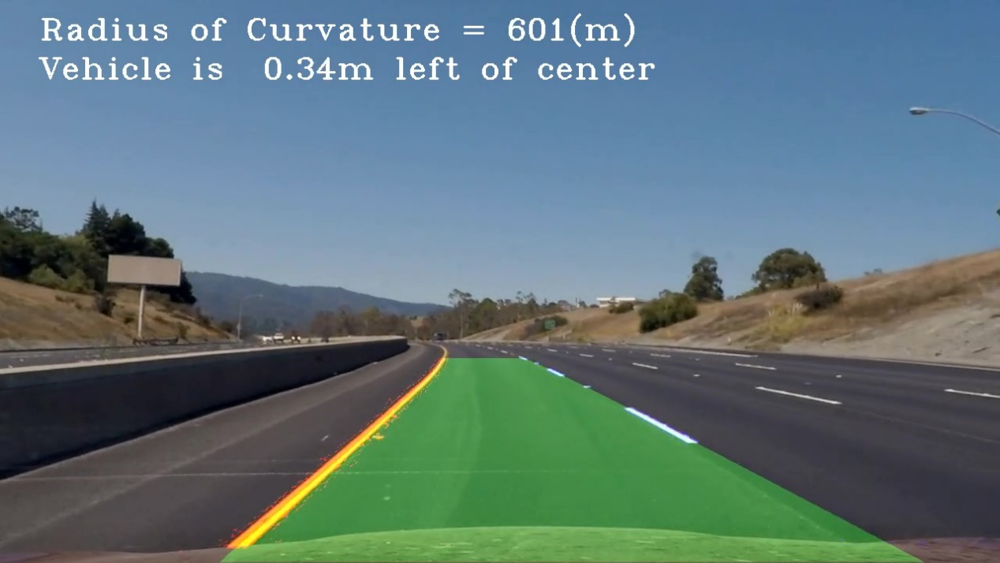

## Advanced Lane Finding Project

---

**The goals / steps of this project are the following:**

The goal of this project is to write a software pipeline to identify the lane boundaries in a video.

Steps:
* Compute the camera calibration matrix and distortion coefficients given a set of chessboard images.
* Apply a distortion correction to raw images.
* Use color transforms, gradients, etc., to create a thresholded binary image.
* Apply a perspective transform to rectify binary image ("birds-eye view").
* Detect lane pixels and fit to find the lane boundary.
* Determine the curvature of the lane and vehicle position with respect to center.
* Warp the detected lane boundaries back onto the original image.
* Output visual display of the lane boundaries and numerical estimation of lane curvature and vehicle position.

[//]: # (Image References)

[image1]: ./examples/undistort_output.png "Undistorted"
[image2]: ./test_images/test1.jpg "Road Transformed"
[image3]: ./examples/binary_combo_example.jpg "Binary Example"
[image4]: ./examples/warped_straight_lines.jpg "Warp Example"
[image5]: ./examples/color_fit_lines.jpg "Fit Visual"
[image6]: ./examples/example_output.jpg "Output"
[video1]: ./project_video.mp4 "Video"
[image7]: ./examples/video_snapshot.png "video_snapshot"
[image8]: ./examples/origin.png "origin"
[image9]: ./examples/undistort.png "undistort"
[image10]: ./examples/binary_roi.png "binary_roi"
[image11]: ./examples/before_warp.png "before_warp"
[image12]: ./examples/warped_color.png "warped_color"
[image13]: ./examples/warped_binary.png "warped_binary"
[image14]: ./examples/poly_generation_1.png "poly_generation_1"
[image15]: ./examples/poly_generation_2.png "poly_generation_2"
[video2]: ./examples/project_video_out.mp4 "video_out"

### Camera Calibration

[Calibration with opencv](https://docs.opencv.org/2.4/doc/tutorials/calib3d/camera_calibration/camera_calibration.html) is carried out in this project. The jupyter notebook `calibration_parameter_generation.ipynb` contains the function to generate camera calibration parameter. Some sample pictures of cheese board locates in `camera_cal/` are used for calibration as input. After the calibration, the parameters, distortion matrix `dist` and camera matrix `mtx` are stored as a pickle file `wide_dist_pickle.p`, which would be used for image undistortion later. This pickle file is already included in this repository, but please feel free to generate it again.

![alt text][image1]

### Pipeline (single images)

#### 1. Image undistortion

The camera matrix is already generated in the last step. In this step, a picture taken by the same camera is undistorted using the two matrices.

Origin       |  Undistorted
:-----------:|:-----------:
![][image8]  |  ![][image9]

We can see that some plants at the left and right edge in the origin picture could no longer be seen in the undistorted one.

#### 2. Steps of getting lane line pixels (generating a binary image with lane line pixels as 1, others as 0)

I used a combination of color and gradient thresholds to generate a binary image (steps at lines 1 through 44 in cell named `building pipeline from now on` in jupyter notebook `lane_line_finder.ipynb`).
1. The 3-channel RGB image is converted to HLS color space.
2. The 3 channels of HLS are individually gaussian blurred.
3. The L channel represents the lightness. A x direction Sobel detection is applied.
4. For the S channel a simple thresholding is applied to filter out the pixels with low saturation.
5. For the H channel a simple thresholding is applied to get the yellow color.
6. The three filtered channels are then combined with OR operator for each pixel. At the same time, a thresholding would be applied to the combined image, to filter out the pixels with low L value.
7. A ROI would be defined. Pixels outside this region would be black out, allowing only the part that lane lines could appear to stay.

Here's an example of my output for this step:
![alt text][image10]

#### 3. Perspective transform

1. Four points are selected on the original image, as source points.
2. Four points are selected to define a region for the four points chosen in step 1 to transformed to. 
3. Calculate the transform and invers-transform matrix M and Minv.
4. Apply the transform on the binary image.

Before warped|  Warped(color)|  Warped(binary)
:-----------:|:-----------:  |:-----------:
![][image11] |  ![][image12] |  ![][image13]

#### 4. Polinomial fitting

1. The sliding window approach is used here for a single image, to identify the lane-line pixels.
2. Histogram of the lower half of the warped binary image are calculated to get a base position of the left and right lane-line.
3. Two small rectangles are defined as sliding windows, which will start sliding from the base positions calculated in 2, one for the left line and one for the right line. Every pixel lands in these two rectangles is classified as lane line pixel, either for left or right. 
4. The two windows slide upwards, until they reach the top of the image. If the number of pixels in a window is greater than a threshold, the x position of the window would be adjusted.
5. Opencv method “polyfit()“ is apply to the pixels belong to the left lane line, to fit a polynomial representing the line. Same to the right lane line. 

Here's an example of my output for this step:
Example 1    |  Example 2
:-----------:|:-----------:
![][image14] |  ![][image15]

#### 5. Calculation of the radius of curvature of the lane and the position of the vehicle with respect to center.

1. As the road width is around 3.7 meters, to convert the x direction distance on the image to meter, the pixel number should multiply 3.7/600 (approximately).
2. As a segment of a dash lane-line is around 3 meters, to convert the y direction distance on the image to meter, the pixel number should multiply 3/90 (approximately)
3. New polynomials for the left and right lane-lines with the calibration mentioned in 1 and 2 are calculated.
4. The curvature radius right before the vehicle should be calculated. The maximum y value, which is the height of the image, is fed to the curvature radius format for 2nd-order polynomial to calculate the radius.
5. For offset calculation, the middle point of the two x coordinates of the polynomials at the image bottom. The distance between this middle point and the middle point of the whole image is the offset of the vehicle with respect to the center of the lane (don’t forget to apply the calibration mentioned in 1 to get meters).

---

### Result

Here's a [link to my video result][video2]

---

### Discussion

This is a very intense project. It is not that easy to identify the lane-lines in different lighting condition. I found that it might not be enough just using the l channel and s channel to get the line clearly, so I add the h channel to consideration, with which it is easier to locate the yellow lane line.
